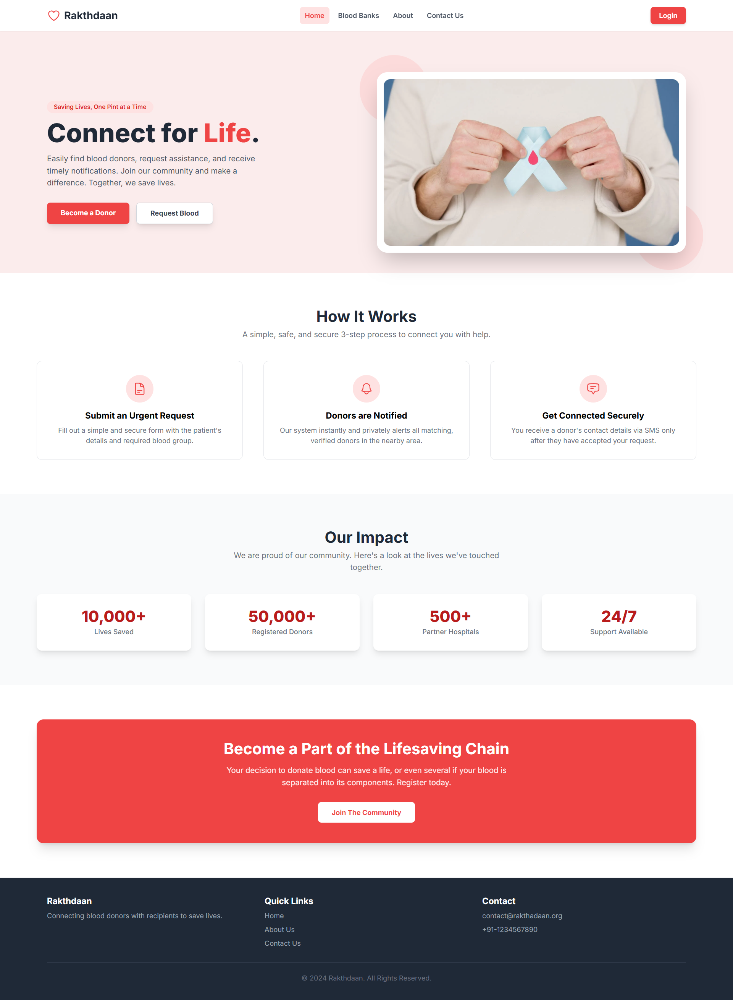
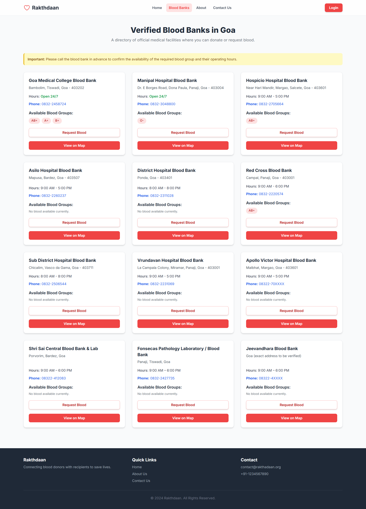
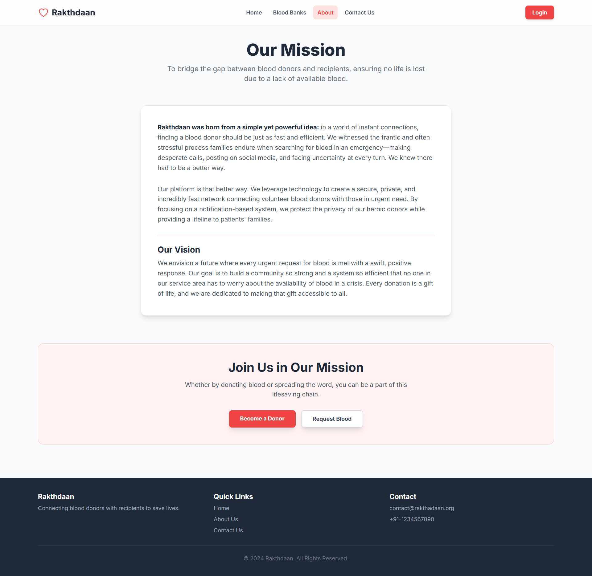
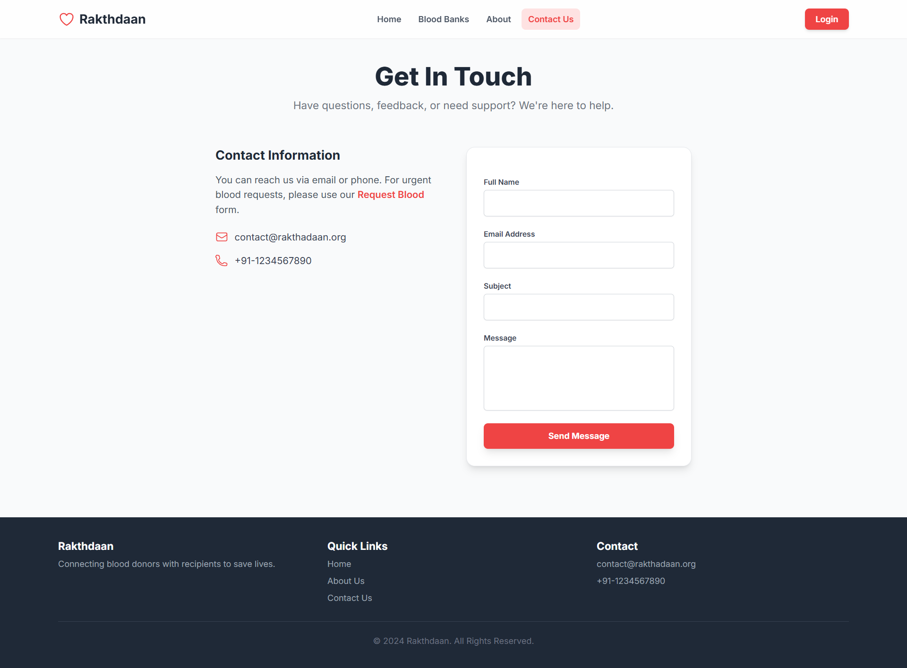
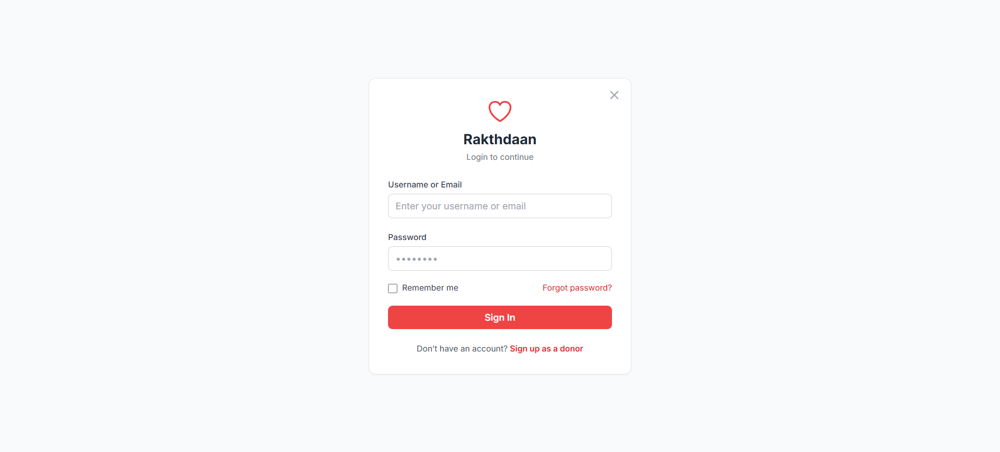
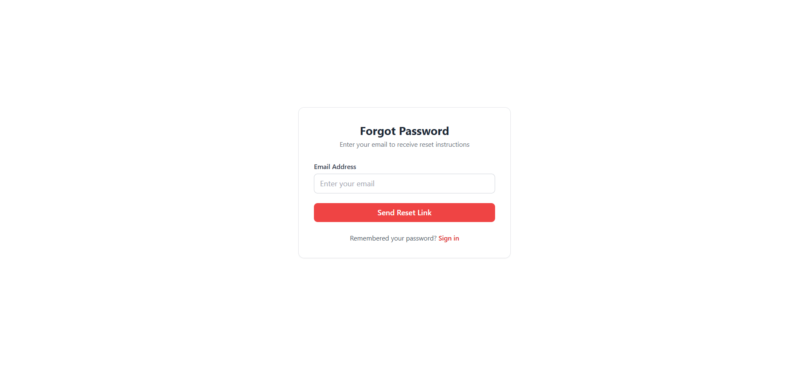
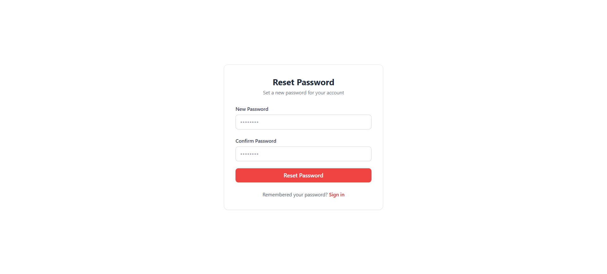
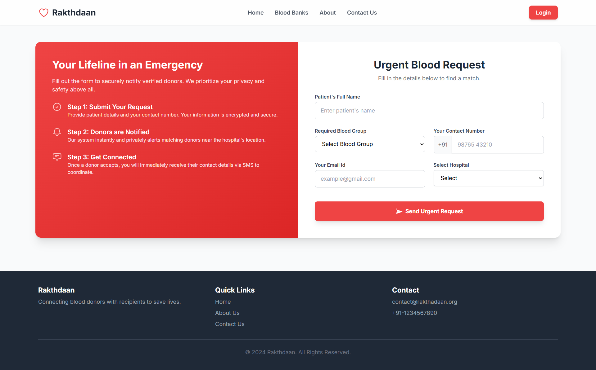
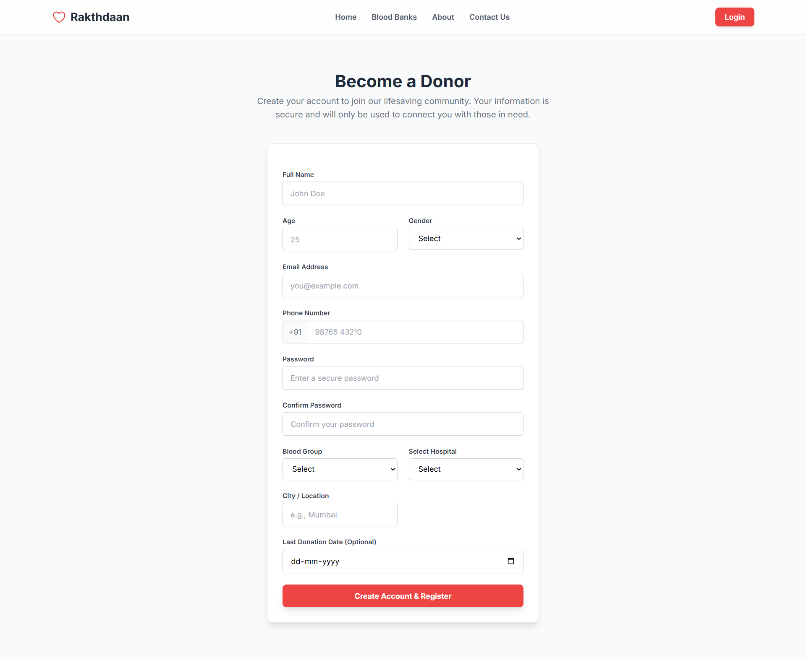
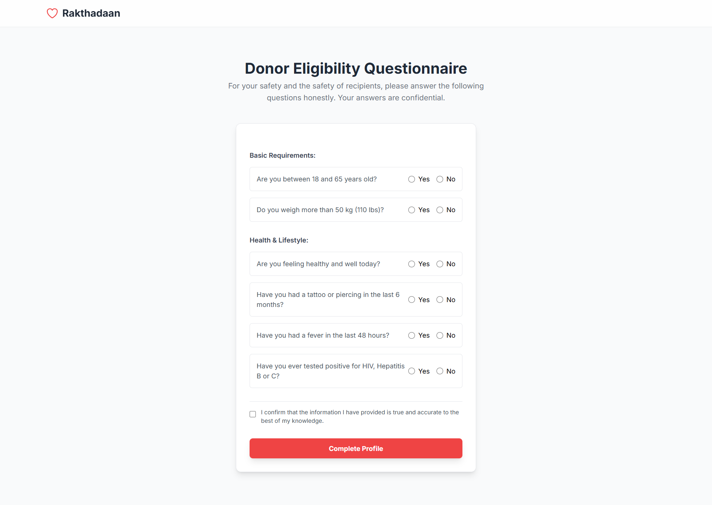

# Rakthdaan – Blood Donation & Request Platform

Rakthdaan is a web-based platform built to bridge the gap between **blood donors**, **patients**, and **hospitals**.  
It provides a simple and efficient system where **patients can request blood**, **donors can register to donate**, and **hospital admins can manage and approve requests** — all in one place.

---

## Features

### For Hospital Admins
- Dedicated **admin panel** to manage all operations.
- Approve or decline **donor registrations**.
- Approve or decline **blood requests** from patients.
- View and monitor donor and patient databases.

### For Donors
- Register as a **blood donor** with personal and blood group details.
- Receive notifications once the **registration is approved** by the hospital admin.

### For Patients
- Submit a **blood request** specifying blood group and hospital.
- Get notified once the **request is approved** and suitable donors are available.

### General Features
- Built with **Django** and **Django HTML templates**.
- Clean and user-friendly interface.
- Secure and efficient data handling using Django ORM.
- Real-time feedback and approval updates.

---

## Tech Stack

| Component | Technology Used |
|------------|-----------------|
| Backend | Django |
| Frontend | HTML, CSS, JavaScript (Django Templates) |
| Database | SQLite (Default Django DB) |
| Styling | TailwindCSS / Custom CSS |
| Framework | Django MVC Architecture |

---

## How It Works

1. **Patient** registers and requests blood through the website.  
2. **Donor** registers to donate blood by filling in their details.  
3. **Hospital Admin** verifies and approves requests from both sides.  
4. Once approved:  
   - The **donor** receives a confirmation email/message.  
   - The **patient** is notified when the **blood request is approved**.  

---

Screenshots

