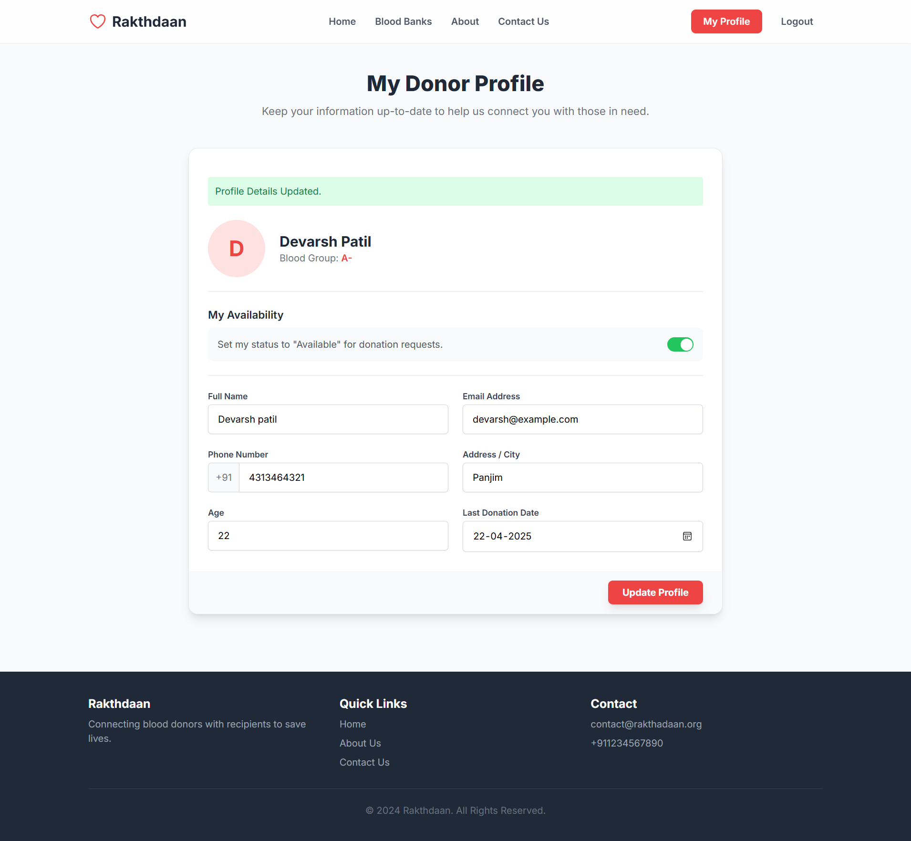
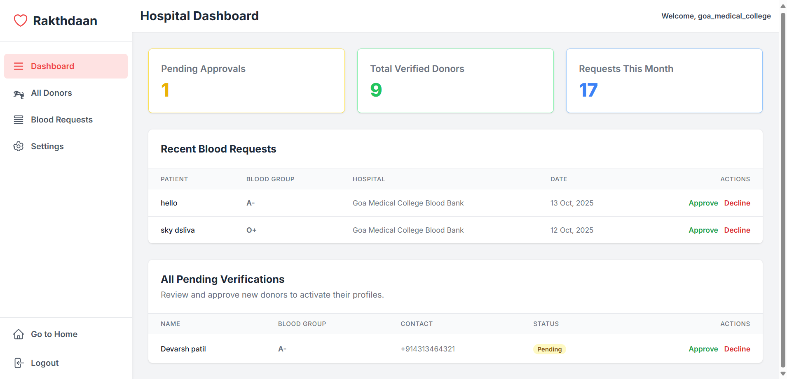
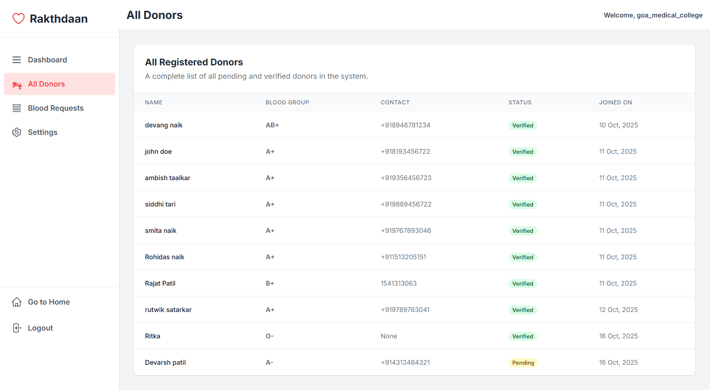
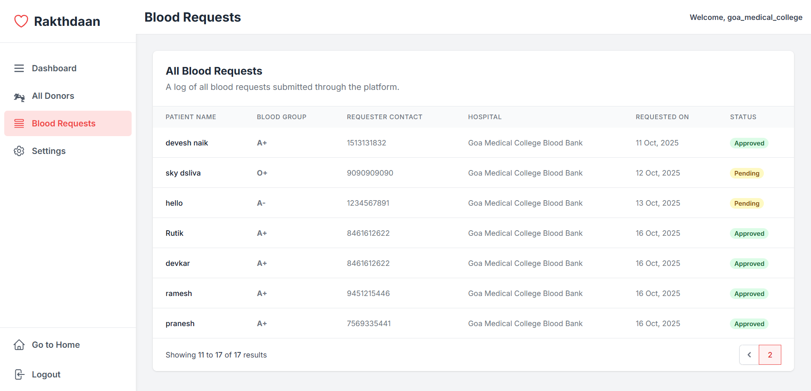
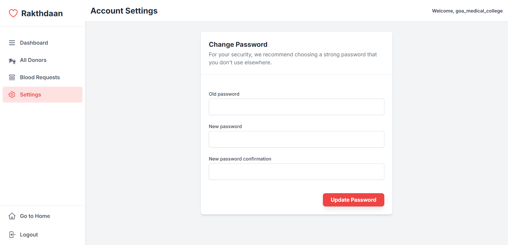

````markdown
# Rakthdaan – Blood Donation & Request Platform

**Rakthdaan** is a web-based platform built to bridge the gap between **blood donors**, **patients**, and **hospitals**.  
It provides a simple and efficient system where patients can request blood, donors can register to donate, and hospital admins can manage and approve these requests — all in one place.

---

## Key Features

### Admin (Hospital Staff)
- **Dashboard:** A dedicated admin panel with key statistics, including the number of pending donor approvals, total verified donors, and total blood requests for the current month.  
- **Donor Management:** View a complete list of all registered donors (pending and verified). Admins can approve or decline applications, triggering **automated email notifications** to the donor.  
- **Request Management:** View all blood requests submitted to the hospital. Approving a request automatically notifies all **matching and available donors** associated with that hospital.  
- **Secure Authentication:** Secure login system with password change functionality via account settings.  

---

### Donor
- **Simple Registration:** Easy form for new donors to register with personal details, blood group, and hospital.  
- **Eligibility Check:** Mandatory questionnaire to ensure donors meet health requirements.  
- **Donor Profile:** Donors can update contact info, address, age, and last donation date.  
- **Availability Status:** Donors can toggle their status to control whether they receive blood request notifications.  
- **Automated Notifications:** Donors receive email alerts on registration, approval/rejection, and for matching blood requests.  

---

### Patient / General User
- **Urgent Blood Request:** A simple form for patients/relatives to request blood with patient name, blood group, contact details, and hospital.  
- **View Blood Banks:** List of verified blood banks with contact info, working hours, and available blood groups.  
- **Password Reset:** Secure “Forgot Password” feature allowing users to reset passwords via email.  
- **Contact Form:** Users can send feedback or inquiries to the platform admins.  

---

## Tech Stack

| **Component** | **Technology Used** |
|----------------|---------------------|
| **Backend** | Django |
| **Frontend** | Django Template Language, HTML, TailwindCSS |
| **Database** | SQLite3 (Default) |
| **Email API** | Mailtrap (for development) |
| **Libraries** | django-phonenumber-field |
| **Framework** | Django MVT (Model-View-Template) Architecture |

---

## Getting Started

Follow the steps below to set up the project locally for development and testing.

### Prerequisites
- Python 3.8+
- pip (Python package installer)

---

### Installation

1. **Clone the repository**
   ```bash
   git clone https://github.com/mayurkhedekar65/abhimay-project1.git
   cd abhimay-project1/AbhiMay-Project1-main
````

2. **Create and activate a virtual environment**

   ```bash
   # For Windows
   python -m venv env
   .\env\Scripts\activate

   # For macOS/Linux
   python3 -m venv env
   source env/bin/activate
   ```

3. **Install the required packages**

   ```bash
   pip install -r requirements.txt
   ```

   > *If the file doesn’t exist, create it with:*

   ```bash
   pip freeze > requirements.txt
   ```

4. **Apply database migrations**

   ```bash
   python newproject/manage.py makemigrations
   python newproject/manage.py migrate
   ```

5. **Create a superuser to access the admin panel**

   ```bash
   python newproject/manage.py createsuperuser
   ```

   Follow the prompts to create your admin credentials.
   *(This admin can create hospital accounts and manage all data.)*

6. **Run the development server**

   ```bash
   python newproject/manage.py runserver
   ```

7. **Open the application**

   ```
   http://127.0.0.1:8000/
   ```

---

## Screenshots

### Home Page


### Blood Bank Directory


### About Us Page


### Contact Us Page


### Login Page


### Forgot Password Page


### Reset Password Page


### Urgent Blood Request Page


### Donor Registration Form


### Donor Eligibility Form


### Donor Profile Page



### Admin Dashboard



### All Donors (Admin View)



### Blood Requests (Admin)



### Admin Settings Page



---

## Contact

If you have any questions, suggestions, or issues regarding this project, feel free to reach out via the **Contact Us** page on the platform or open an issue in the repository.

---

**Developed with ❤️ using Django & TailwindCSS**

```
```
